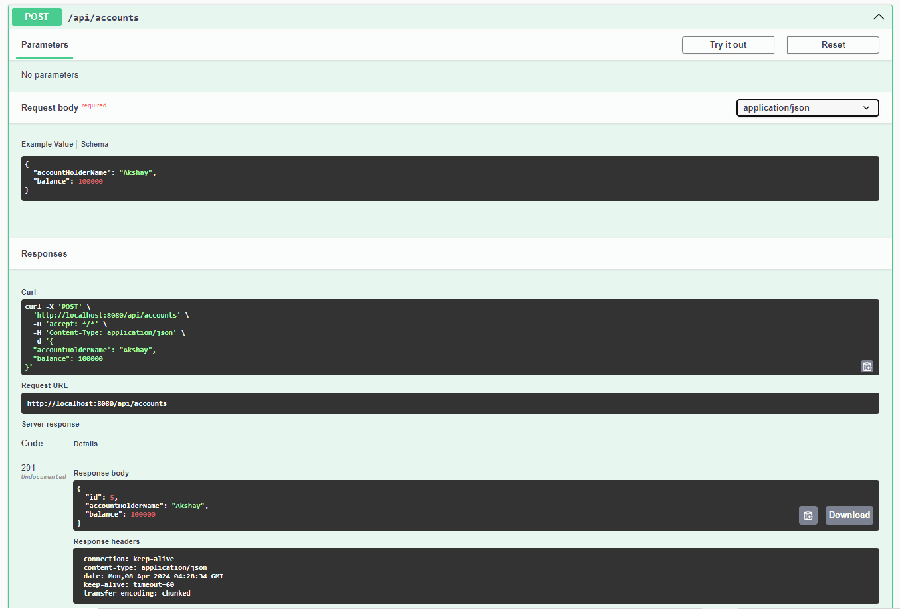
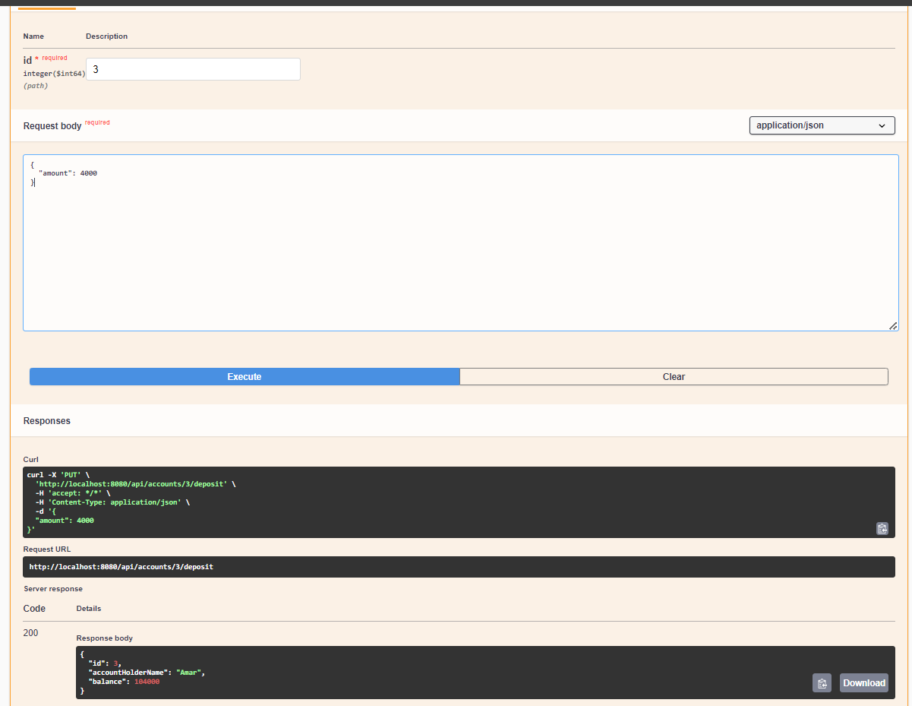
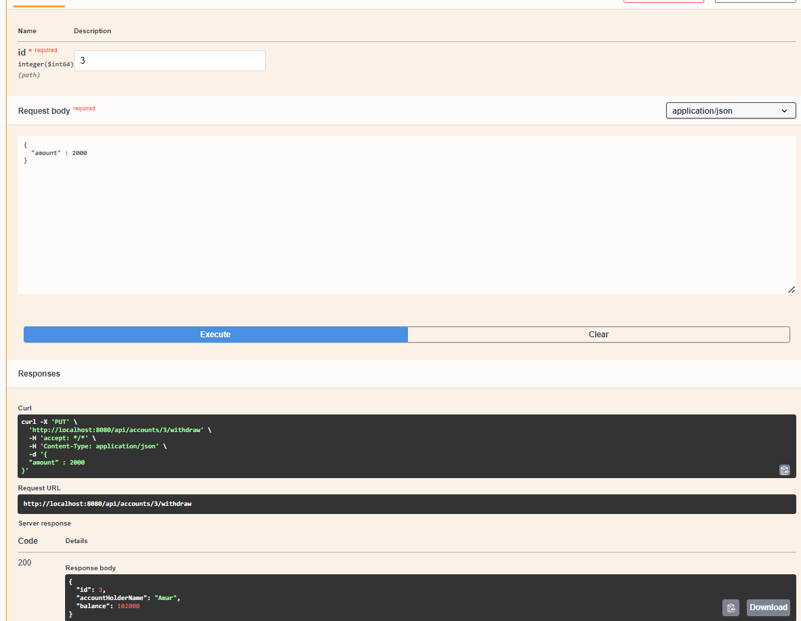
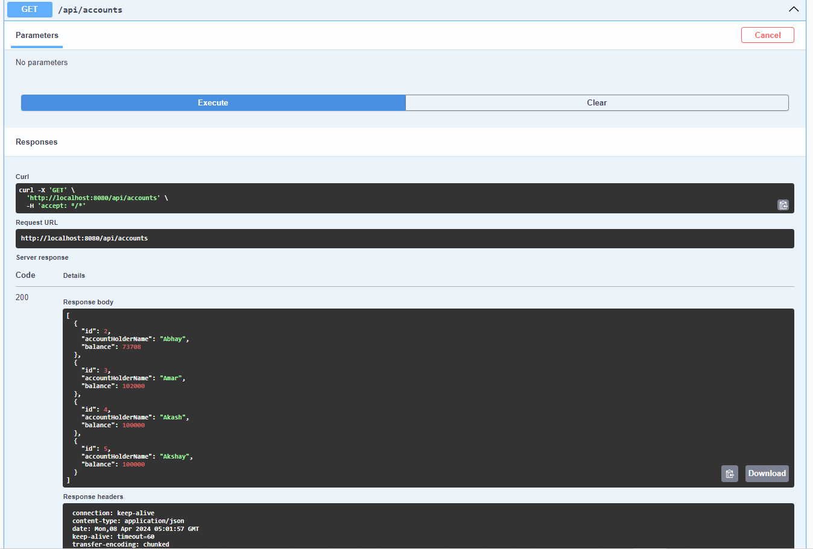
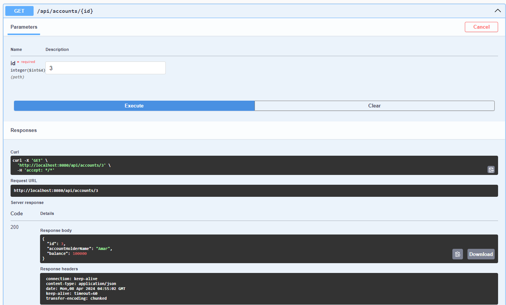

# BankingApplicationRestAPIs

BankingApplicationRestAPIs is a Spring Boot-based RESTful service that allows you to perform operations related to banking accounts such as creating new accounts, depositing and withdrawing funds, and querying account details.

## Features

- ✅ Create new bank accounts.
- 💰 Deposit funds into an account.
- 💸 Withdraw funds from an account.
- 📖 View account details.
- 📋 List all accounts.

## How to Use 🛠️

To use these APIs, send HTTP requests to the following endpoints:

- `POST /api/accounts` - Create a new account.
- `PUT /api/accounts/{id}/deposit` - Deposit funds into an account.
- `PUT /api/accounts/{id}/withdraw` - Withdraw funds from an account.
- `GET /api/accounts` - List all accounts.
- `GET /api/accounts/{id}` - Get details for a specific account.

## Create a new account.

## Deposit funds into a account

## Withdraw funds from an account

## List all accounts

## Get details for specific account.

